## 计算机毕业设计Python+卷积神经网络Web漏洞扫描系统 网络安全 信息安全 机器学习 深度学习 大数据毕业设计 数据可视化 Python毕业设计 Python爬虫

## 要求
### 源码有偿！一套(论文 PPT 源码+sql脚本+教程)

### 
### 加好友前帮忙start一下，并备注github有偿Web漏洞扫描
### 我的QQ号是2827724252或者798059319或者 1679232425或者微信:bysj2023nb

# 

### 加qq好友说明（被部分 网友整得心力交瘁）：
    1.加好友务必按照格式备注
    2.避免浪费各自的时间！
    3.当“客服”不容易，repo 主是体面人，不爆粗，性格好，文明人。
	
## 介绍
10年软件开发经验，学长只做高级精品！
全职全栈全天候主攻Vue 、SpringBoot、 Python、知识图谱、算法、Hadoop、Spark等各种创新都能做。
精通Bert、LSTM、CNN、MLP、SVD等机器学习深度学习流行框架。

## 演示视频
https://www.bilibili.com/video/BV16jDBYVE8J

## 运行截图

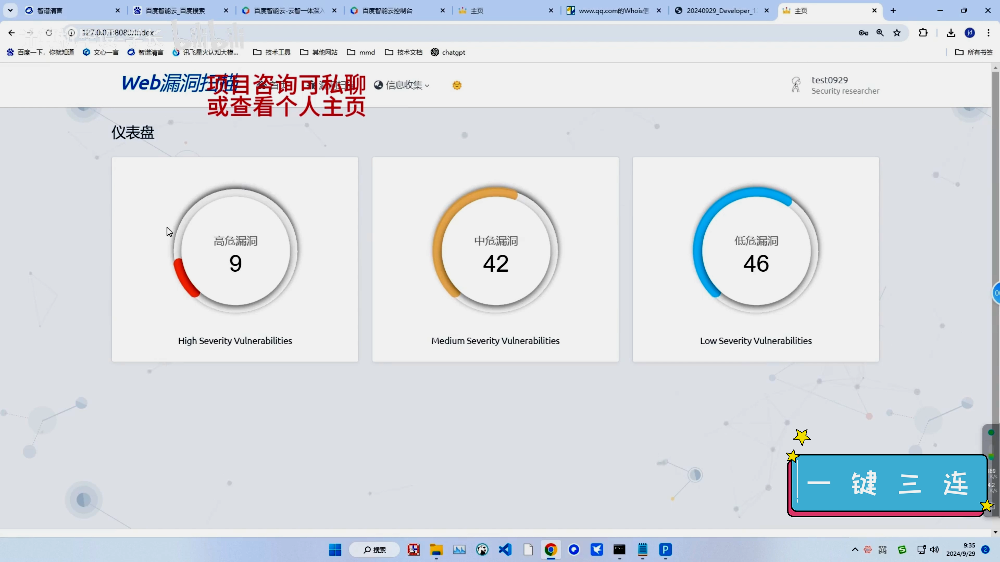
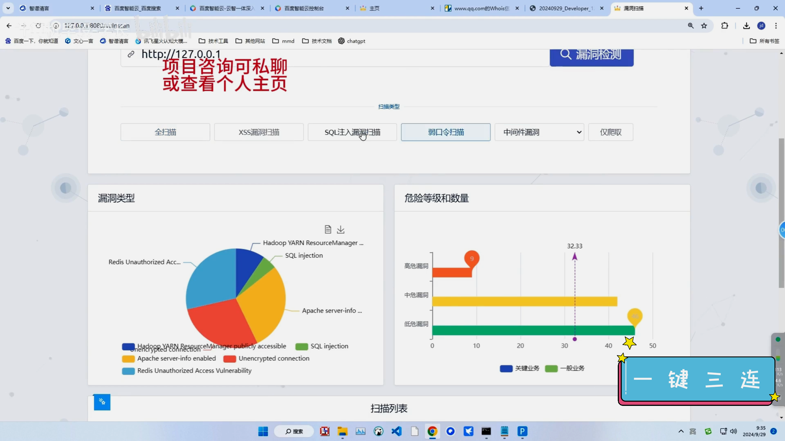
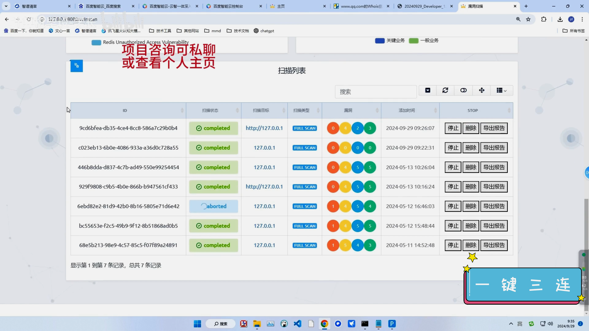
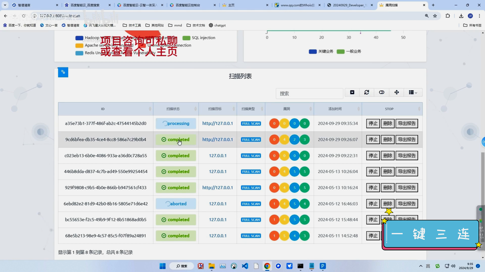
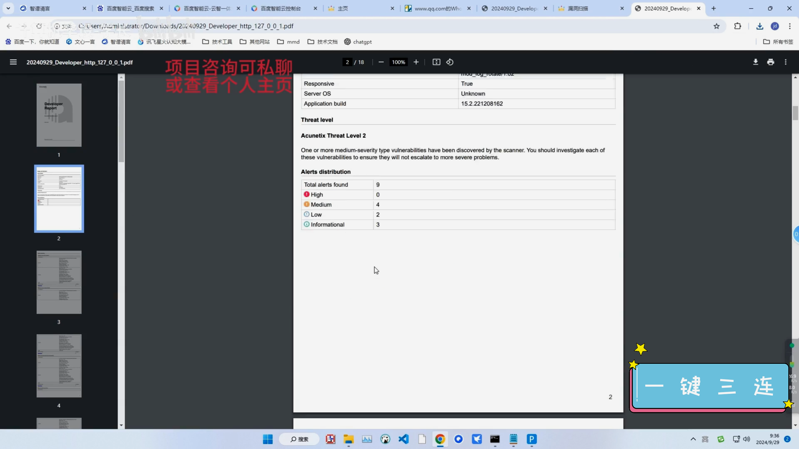
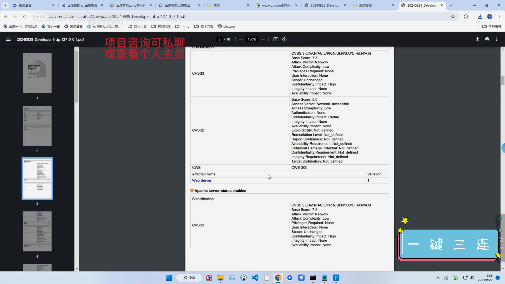
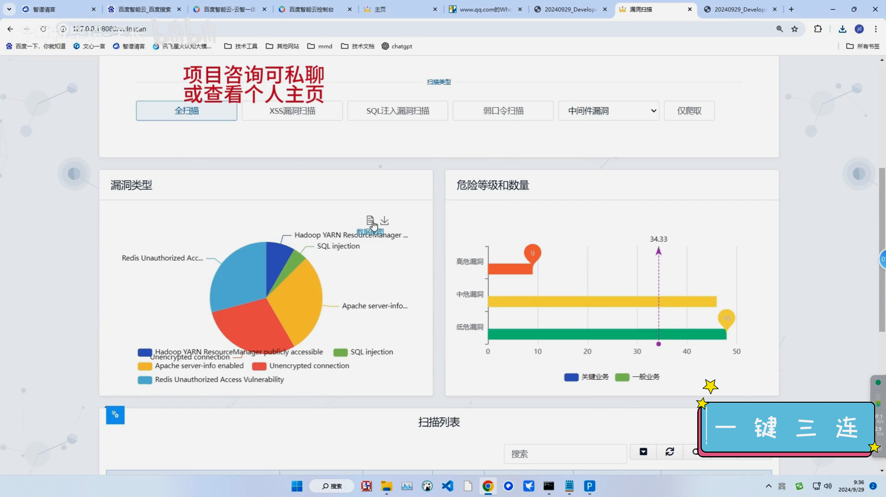
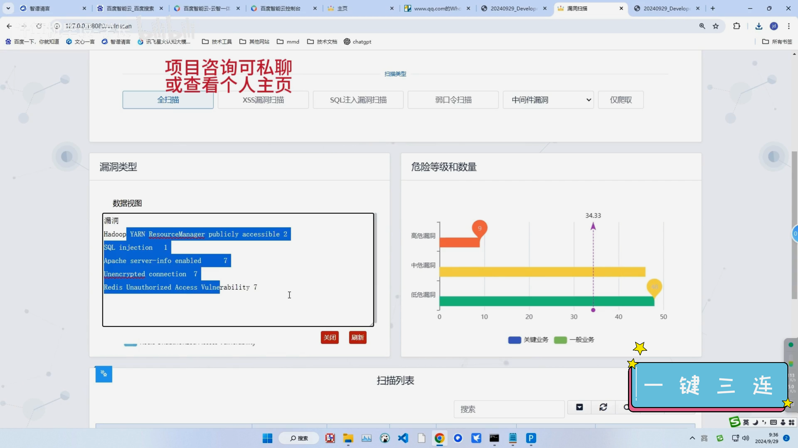
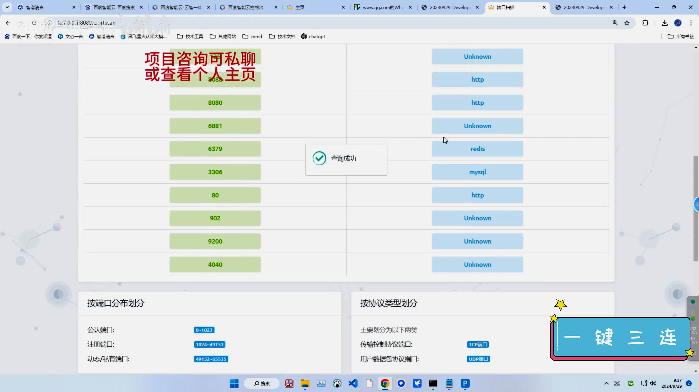
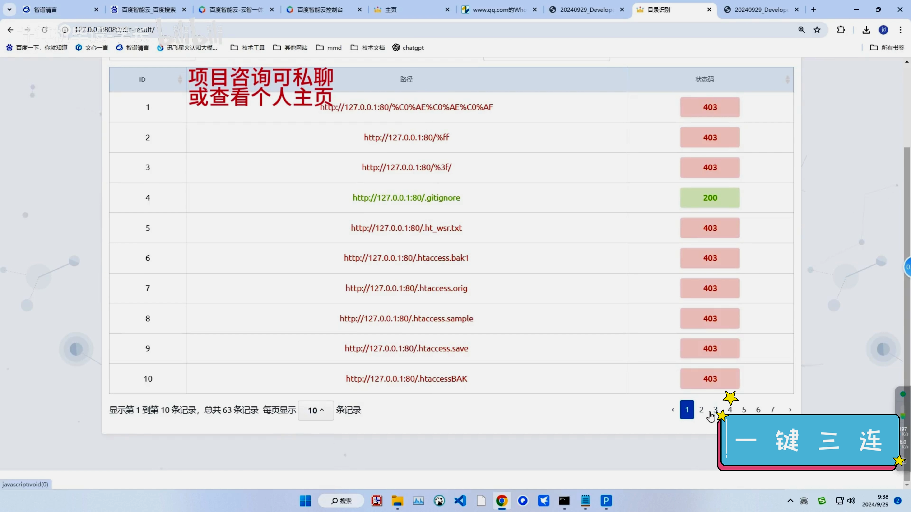
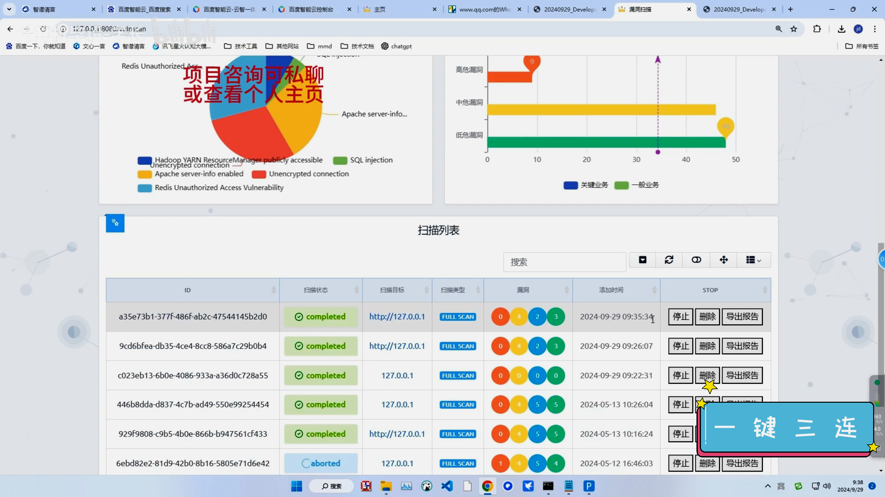
